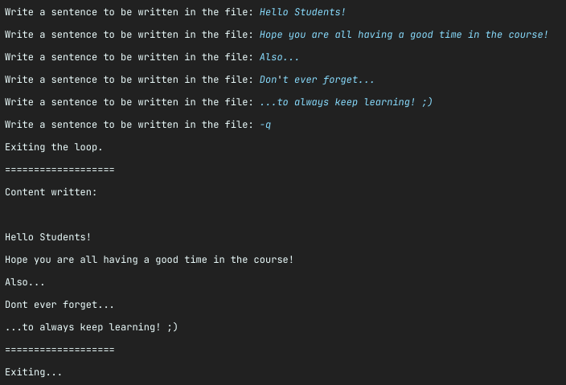

# Files - Writer & Reader

In this exercise, you are supposed to write a program that will capture inputs from the user using
the keyboard **WRITE** the contents to a file until the program exits, and then **READ** the file
and print the result on the console.

The user will be asked to type inputs in an infinite loop, until a specified command is typed, that
signs the loop should end and the content of the file printed.

This will all be done using the `Files` class.

##

## Step 1: Getting familiar with the main class

Take a look at the `WriterReader` class. It is the class that contains our `main` method.

In this class you'll also find **3** constants:

- `FILE_NAME`: Contains the name of the file that should be created, which is `output.txt`;


- `EXIT`: Contains the command the user should write to end the loop, which is `-q`;


- `LINE_SEPARATOR`: Contains an OS specific character that translates to a line break. You'll use
  this in order to write each of the user's input in a different line. Note that it uses
  the `System.lineSeparator()` from Java to achieve it.

##

## Step 2: Create the file

The first thing you should care about is creating the file.

Create a `Path` with the `FILE_NAME`. After that, using `Files`, create a new file with the given
path.

In order to assure that content from previous executions from the program is not taken into account,
you'll also want to **delete** the file prior to creating it, so we are sure the file will be fresh
when we start the program.

##

## Step 3: Capturing the keyboard

As done a couple of times before, you should capture the keyboard directly from the `System.in`.
Both the `InputStreamReader` and the `BufferedReader` will be used here.

> **Hint:** You can also wrap your whole code in a `try-with-resources`,
> declaring the keyboard as a resource.

##

## Step 4: Loop to capture user's input

Now you should create an **infinite loop**, that will print the following message to the user:

```java
System.out.print("Write a sentence to be written in the file: ");
```

Using the `keyboard`, capture the line inputted by the user.

The value inputted will lead to two different scenarios:

###

### Step 4.1: Exiting the loop

You should match the inputted value against the `EXIT` constant. If it is true (if the user
types `-q`), then you should print:

```java
System.out.println("Exiting the loop.");
```

...and exit the loop.

###

### Step 4.2: Exiting the loop

If the user typed something else, then we should write the sentence to our file.

You can use whichever method from the `Files` class is more convenient for you, but you must always
pass the `StandardOpenOption.APPEND` as the `OpenOption` parameter. If not provided, every time you
write to the file, it'll simply overwrite the previous content.

Don't forget to also write the `LINE_SEPARATOR` at the end of the sentence, otherwise you'll have
all the sentences provided by the user in one single line.

##

## Step 5: Reading the content

Now it's time to read the content of our file and print it to the user.

Using whichever method you prefer from `Files`, read the content from the file and print it on the
console, line by line.

##

## Testing the program

If everything was done correctly, you should have an output similar to the following:

